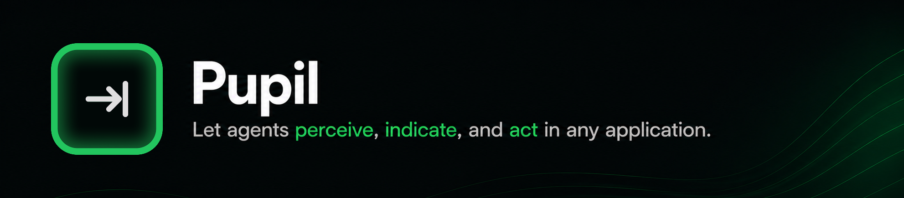
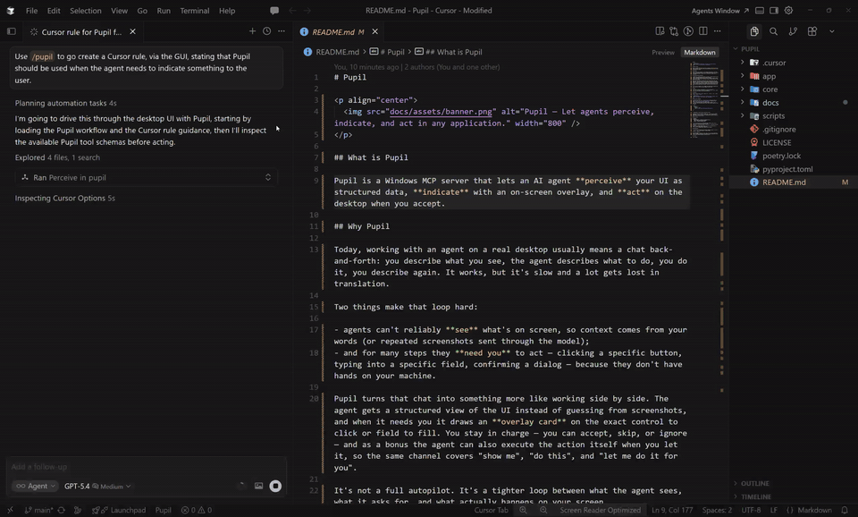
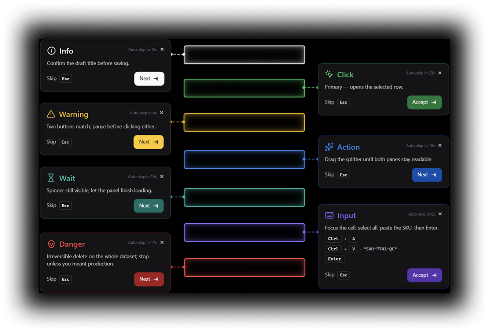
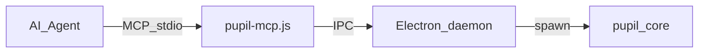

# Pupil

<p align="center">
  
</p>

Pupil is a Windows MCP server that lets an AI agent **perceive** your UI as structured data, **indicate** with an on-screen overlay, and **act** on the desktop when you accept.

Demo where the human operator only does : `Tab`, `Tab`, `Tab`...

<p align="center">
  <a href="docs/assets/demo.mp4">
    
  </a>
</p>

<p align="center"><sub>Click the GIF for the full-quality MP4.</sub></p>

## Why Pupil

Today, working with an agent on a real desktop usually means a chat back-and-forth: you describe what you see, the agent describes what to do, you do it, you describe again. It works, but it's slow and a lot gets lost in translation.

Two things make that loop hard:

- agents can't reliably **see** what's on screen, so context comes from your words (or repeated screenshots sent through the model);
- and for many steps they **need you** to act — clicking a specific button, typing into a specific field, confirming a dialog — because they don't have hands on your machine.

Pupil turns that chat into something more like working side by side. The agent gets a structured view of the UI instead of guessing from screenshots, and when it needs you it draws an **overlay card** on the exact control to click or field to fill. You stay in charge — you can accept, skip, or ignore — and as a bonus the agent can also execute the action itself when you let it, so the same channel covers "show me", "do this", and "let me do it for you".

It's not a full autopilot. It's a tighter loop between what the agent sees, what it asks for, and what actually happens on your screen.

## Examples

Overlay cards for each `indicate` type (`info`, `warning`, `wait`, `danger`, `click`, `action`, `input`):

<p align="center">
  
</p>

## Quick start (Windows)

1. From the repo root, run `.\scripts\build.ps1` — builds the .NET core, copies `pupil-core.exe` into `app\vendor\win32-x64\`, then runs `pnpm install` and `pnpm rebuild electron` under `app\`.
2. Point Cursor’s MCP config at the Node entrypoint. Replace `<path-to-pupil-repo>` with the absolute path to your clone (forward slashes are fine on Windows):

```json
{
  "mcpServers": {
    "pupil": {
      "command": "node",
      "args": ["<path-to-pupil-repo>/app/bin/pupil-mcp.js"]
    }
  }
}
```

3. Reload MCP or restart Cursor so the server starts.

If native binaries are missing or locked, run `.\scripts\kill.ps1` before rebuilding. `.\scripts\smoke.ps1` runs a basic syntax + bridge check. A legacy Python server in [`mcp/main.py`](mcp/main.py) exists for reference — see [`docs/MCP.md`](docs/MCP.md).

## How it works



- **`app/bin/pupil-mcp.js`** — MCP stdio entry; loads [`app/src/shim`](app/src/shim) and the Electron overlay daemon.
- **`core/`** — .NET native sidecar (`pupil-core.exe`) that does the actual perception.
- **`mcp/`** — optional Python server ([`mcp/main.py`](mcp/main.py)) — legacy / minimal; most setups use Node only.
- **`scripts/`** — Windows build, smoke, and kill helpers.

## Documentation

- [`docs/MCP.md`](docs/MCP.md) — full MCP & indicator contract (`perceive` / `indicate`, types, accept semantics, response shape).

## Status & community

Early development, **Windows-focused** today. This is my first open-source project — feedback, bug reports, and questions are very welcome via [GitHub Issues](https://github.com/ADevillers/Pupil/issues).

## License

[MIT](LICENSE)
