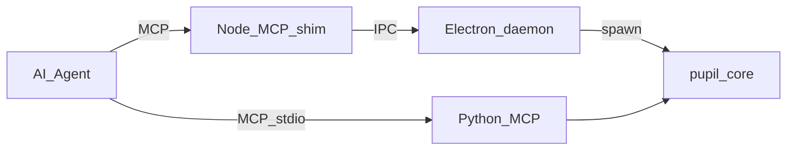

# Pupil

**Let agents perceive, indicate, and act in any application.**

> This is my first open-source project — feedback and questions are very welcome (open a [GitHub Issue](https://github.com/ADevillers/Pupil/issues)).

## What it is

Pupil is a **Windows** stack for AI agents: it **perceives** UI as structured data, **indicates** decisions to a human (highlights, cards, click/input), and can **act** in the real desktop. It is early software: expect rough edges, and use it at your own risk on machines you control.

## Architecture at a glance



- **`app/`** — Node MCP shim ([`app/src/shim`](app/src/shim)), Electron overlay daemon, `pnpm` + Electron.
- **`core/`** — .NET native sidecar built to `pupil-core.exe` and vendored for the app.
- **`mcp/`** — Python MCP server over stdio ([`mcp/main.py`](mcp/main.py)); legacy rectangle tools + path to the full model.
- **`scripts/`** — Build, smoke, and kill helpers for Windows.
- **`.cursor/skills/pupil/`** — Optional Cursor skill for the perceive / indicate loop.

## Quick start (Windows)

1. From the repo root, run `.\scripts\build.ps1` — builds the .NET core, copies `pupil-core.exe` into `app\vendor\win32-x64\`, then runs `pnpm install` and `pnpm rebuild electron` under `app\`.
2. Install Python dependencies for the MCP package (Poetry / your workflow).
3. Start the Python MCP server:
   - `python .\mcp\main.py`

If native binaries are missing or locked, run `.\scripts\kill.ps1` before rebuilding.

### Other scripts

- **`.\scripts\smoke.ps1`** — Python syntax checks for the MCP package, bridge checks, short manual integration checklist.
- **`.\scripts\kill.ps1`** — Force-stops the Pupil Electron daemon (processes whose command line includes `daemon\main.cjs`) and `pupil-core.exe` sidecars. Use before `.\scripts\build.ps1` if copies fail because files are locked.

## MCP server (v1)

The Python MCP server lives in [`mcp/main.py`](mcp/main.py) and exposes these tools:

- `perceive(overlay_hwnd: int | None = None) -> list[dict]`
- `indicate_rect(x: int, y: int, w: int, h: int, color: str = "#00FFFF", alpha: float = 0.14) -> dict`
- `clear() -> dict`

### Tool contract (Python server)

- `perceive` returns parsed UI nodes from `PerceptionApi.Perceive`.
- `perceive` automatically excludes the overlay window by default.
- `indicate_rect` draws one highlighted rectangle and replaces any previous one.
- `clear` removes the current overlay rectangle.
- If the sidecar or DLL is missing, run `.\scripts\build.ps1` first.

### Node MCP shim (`app/src/shim`) — indicator shape

`perceive` takes **no arguments**. `indicate` takes a **flat** object (no nested `indicator` wrapper):

- `type` — `info` | `warning` | `wait` | `action` | `click` | `input` | `danger`
- `coords` — optional string `"x,y,w,h"` (integers, `w` and `h` positive). **Required** for `click` only; optional for `input` (recommended when a specific control must receive focus before chords).
- `desc` — optional extra copy; omit unless it adds information the highlight does not (do not repeat the control label).
- `value` — **required** for `input` only: object `{ clip?: string, chords: string[][] }`. `chords` is a non-empty list of chord steps (nut-js `Key` names per chord, modifiers first, ~50ms between steps). Optional `clip`: before chords run, the daemon saves the current plain-text clipboard, writes `clip`, runs `chords` (typically including `Ctrl+V`), then restores the saved text in a `finally` so failures do not leave `clip` on the clipboard. **Accept on `click`** performs a single OS click at the **center** of the `coords` bbox. **Accept on `input` with `coords`** does the same center click first to focus, then runs clipboard + chords as above; **without `coords`**, the daemon blurs the overlay and sends chords to the previous foreground window (best-effort).

**Automation preference:** prioritize **`click`** on a control listed in `perceive` over **`input`** with keyboard shortcuts when both achieve the same result (for example click **Save** instead of Ctrl+S, **OK** instead of Enter). Use **`input`** for typing and paste, shortcuts with no reliable on-screen target, or when the CSV has no suitable row.

Every `indicate` call **replaces** any prior card and **blocks** until the user resolves it. The card header label is derived from `type`. Footer buttons:

- `info` / `warning` / `wait` / `action` / `danger`: **Next** only (Tab). Resolves `"done"`.
- `click` / `input`: **Skip** (**Escape**) + **Accept** (**Tab**). Accept runs the OS action, then resolves `"done"`.

After Next/Accept, the card shows a spinner until the **next** `indicate` clears it. **X** resolves `"skipped"`.

On success, the MCP tool response is JSON text shaped like:

```json
{ "result": "done", "perceive": "<compact CSV; same schema as perceive tool>" }
```

Each `indicate` returns the next `perceive` snapshot (taken ~50ms after the resolved action), so a separate `perceive()` is only needed for the very first read (or after a long external delay or user-side change outside Pupil). In that bundled CSV only, each row’s `name` field is truncated after 100 characters with `...` appended; the standalone `perceive` tool does not truncate names.

### Indicator buttons & lifecycle (Python `mcp/main.py`)

Legacy rectangle overlay; see Node shim above for the full Pupil indicator model.

### Cursor MCP registration (example)

Configure a local MCP server command that launches:

- command: `python`
- args: `[".\\mcp\\main.py"]`
- working directory: repository root

## Status & roadmap

- Early development; **Windows-focused** today.
- Integrations and docs will grow as the project stabilizes.

## How to reach me

**GitHub Issues:** [github.com/ADevillers/Pupil/issues](https://github.com/ADevillers/Pupil/issues) — bugs, ideas, and questions.

## License

This project is licensed under the [MIT License](LICENSE).
